# ALMS — Complete Architecture & Implementation Documentation

> Smart India Hackathon 2024 · PS-26090 · Ministry of Social Justice and Empowerment  
> Full-stack AI-powered marketplace for India's marginalized artisans

---

## Table of Contents

1. [Project Overview](#1-project-overview)
2. [System Architecture](#2-system-architecture)
3. [Technology Stack Deep Dive](#3-technology-stack-deep-dive)
4. [Service Breakdown](#4-service-breakdown)
5. [Database Schema & Relationships](#5-database-schema--relationships)
6. [AI Pipeline Workflows](#6-ai-pipeline-workflows)
7. [Key Workflows End-to-End](#7-key-workflows-end-to-end)
8. [Security Architecture](#8-security-architecture)
9. [Real-Time Communication](#9-real-time-communication)
10. [B2B Commerce Flow](#10-b2b-commerce-flow)
11. [Trust Score System](#11-trust-score-system)
12. [BullMQ Job Queue Architecture](#12-bullmq-job-queue-architecture)
13. [Frontend Architecture](#13-frontend-architecture)
14. [Deployment Architecture](#14-deployment-architecture)
15. [Implementation Plan & Waves](#15-implementation-plan--waves)
16. [Property-Based Test Coverage](#16-property-based-test-coverage)
17. [Government Integrations](#17-government-integrations)
18. [Mermaid Diagram — Complete System Flow (Generation Prompt)](#18-mermaid-diagram--complete-system-flow-generation-prompt)

---

## 1. Project Overview

### Problem Statement
India has 7 crore+ marginalized artisans (SC/ST/OBC/Divyang craftspeople) who are cut off from fair markets by:
- Digital illiteracy — existing platforms require English and e-commerce knowledge
- Middleman exploitation — aggregators take 15–40% commission
- Poor rural connectivity — current tools fail offline

### Our Solution
ALMS provides a **zero-literacy onboarding path**: the artisan uploads a photo and speaks a few words in their native language. The platform automates everything else — background-removed product photography, multilingual catalog copy, SEO metadata, fair-price recommendations, market discovery, and distribution across ONDC.

### Five User Roles
| Role | Key Capabilities |
|---|---|
| **ARTISAN** | Create listings via voice/image, manage inventory, respond to B2B quotes, view AI pricing + market recommendations |
| **CONSUMER** | Semantic search, browse Craft Atlas, retail purchase, leave reviews |
| **BUYER** | Submit RFQs, receive AI-matched artisan proposals, bulk ordering, wholesale pricing |
| **MODERATOR** | Verify artisan/buyer identities, moderate content, resolve disputes |
| **ADMIN** | Full platform configuration, user management, Trust Score weights, queue monitoring |

### Impact Metrics (Target)
- 0% commission vs 15–40% on legacy platforms
- Cataloging time: hours → minutes (AI automation)
- Market reach: local → ONDC nationwide + international B2B
- First 10,000 artisans at near-zero hosting cost (Supabase + Vercel + R2 free tiers)

---

## 2. System Architecture

### High-Level System Context

```
┌──────────────────────────────────────────────────────────────────────────────┐
│                           External Services                                   │
│  ┌──────────────┐  ┌──────────────┐  ┌──────────────┐  ┌──────────────────┐ │
│  │ Google Gemini│  │Cloudflare R2 │  │ AWS SES /    │  │ DigiLocker API  │ │
│  │ 1.5 Pro API  │  │Object Storage│  │ SendGrid     │  │ ONDC · India Post│ │
│  └──────────────┘  └──────────────┘  └──────────────┘  └──────────────────┘ │
└──────────────────────────────────────────────────────────────────────────────┘
           ▲                   ▲                  ▲                 ▲
           │                   │                  │                 │
┌──────────┼───────────────────┼──────────────────┼─────────────────┼──────────┐
│                         ALMS Platform                                         │
│                                                                               │
│  ┌─────────────────────┐    ┌────────────────────────────────────────────┐   │
│  │   Next.js 14 SPA    │    │           NestJS Monolith (17 modules)     │   │
│  │  App Router + RSC   │◄──►│  Auth · Product · B2B · Messaging · Trust  │   │
│  │  GSAP + Lenis       │    │  Search · Inventory · Disputes · Admin ... │   │
│  │  Zustand + TanStack │    │  BullMQ orchestrator · Socket.io gateway   │   │
│  └─────────────────────┘    └───────────────────┬────────────────────────┘   │
│                                                  │                            │
│  ┌───────────────────────┐   ┌──────────────────▼──────────────────────────┐ │
│  │   FastAPI AI Service  │◄──│         Data Layer                           │ │
│  │  Gemini · rembg       │   │  PostgreSQL 16 + pgvector  │  Redis 7        │ │
│  │  OpenCV · Real-ESRGAN │   │  36+ tables, HNSW index    │  BullMQ queues  │ │
│  │  8 AI pipelines       │   │  Supabase RLS policies     │  Cache + pub/sub│ │
│  └───────────────────────┘   └─────────────────────────────────────────────┘ │
└──────────────────────────────────────────────────────────────────────────────┘
```

### Monolithic-Modular Design Decision

NestJS modules provide clean module boundaries (each owns entities, services, controllers, DTOs) while remaining in one deployable artifact. This gives:
- Simple operations (one process, one deploy)
- Clear separation of concerns via DI
- Future service extraction along module boundaries without architectural changes
- Shared cross-cutting concerns (Auth guard, BullMQ, Redis) injected everywhere via DI

---

## 3. Technology Stack Deep Dive

### Frontend (Next.js 14 App Router)
| Component | Technology | Purpose |
|---|---|---|
| Framework | Next.js 14 + App Router | SSR for SEO-critical product pages; RSC for server-only data fetching; Client components for interactive UI |
| Language | TypeScript 5 | Type safety across entire frontend |
| Styling | Tailwind CSS v3 + CSS logical properties | Utility-first; RTL-ready for future language support |
| Animation | GSAP 3 + ScrollTrigger + Lenis | Homepage scroll-driven storytelling (6+ animation sections) |
| State | Zustand | Lightweight client state for cart, auth, sync queue |
| Data fetching | TanStack Query (React Query) | Cache, background refetch, optimistic updates |
| Real-time | Socket.io client | WebSocket for messages, job progress, notifications |
| Offline | localStorage Sync Queue | 50-entry cap; auto-replay on reconnect |
| i18n | 7 languages | en, hi, bn, te, ta, mr, gu — without full page reload |

### Backend (NestJS)
| Component | Technology | Purpose |
|---|---|---|
| Framework | NestJS 10 | Decorator-driven DI; Guards; Interceptors; Pipes |
| Language | TypeScript 5 | Full type safety |
| ORM | TypeORM + Supabase PostgreSQL | Entities, migrations, parameterized queries |
| Auth | Passport + JWT (RS256) | Access tokens (15-min) + refresh tokens (7-day) |
| Password | Argon2id | Adaptive hashing; resistant to GPU/ASIC attacks |
| Queue | BullMQ 5 + Redis 7 | 8 named queues; dead-letter; exponential backoff |
| WebSocket | Socket.io + Redis adapter | Horizontal-scaling-ready real-time |
| Scheduler | @nestjs/schedule | Cron jobs for notifications, excess inventory, demand surge |
| Rate limiting | @nestjs/throttler + Redis | 100/min IP · 500/min user |
| HTTP security | Helmet | CSP, HSTS, X-Frame-Options, X-XSS-Protection |
| Encryption | Node crypto (AES-256-GCM) | PII field encryption at application layer |

### AI Service (FastAPI)
| Component | Technology | Purpose |
|---|---|---|
| Framework | FastAPI 0.110 + Pydantic v2 | Async HTTP; strict schema validation |
| LLM | Google Gemini 1.5 Pro | Catalog generation (structured JSON via function calling), negotiation drafts, multilingual transcription, translation |
| Image BG removal | REMBG (U2Net model) | Background removal |
| Image enhancement | OpenCV 4 | Lighting/color correction, noise reduction, sharpening |
| Image upscaling | Real-ESRGAN 4x | Upscale sub-1200px images |
| Image output | Pillow + Sharp | Canvas framing to 1200×1200 WebP ≤5 MB |
| Embeddings | Google text-embedding-004 | 768-dim vectors for semantic search |
| Moderation | Gemini Flash | Content classification: SAFE / REQUIRES_REVIEW / VIOLATES_POLICY |
| Testing | Hypothesis (PBT) | Property-based testing for AI output schemas |

### Infrastructure
| Component | Technology | Notes |
|---|---|---|
| Database | PostgreSQL 16 via Supabase | pgvector extension; HNSW index; pg_trgm; RLS |
| Vector index | pgvector HNSW (m=16, ef_construction=64) | Sub-50ms ANN at 1M+ products |
| Cache + Queue | Redis 7 | BullMQ jobs; rate-limit counters; Trust Score cache; WebSocket pub/sub |
| Object storage | Cloudflare R2 | Zero egress cost; private buckets; signed URLs only |
| Container | Docker Compose | Local dev: db + redis + backend + ai_service + frontend |
| Deployment | Vercel (frontend + backend) + Cloud Run (AI service) | Monorepo with vercel.json |

---

## 4. Service Breakdown

### Backend — 17 NestJS Modules

```
AuthModule
  POST /auth/register        — create UNVERIFIED account, send verification email
  POST /auth/login           — validate credentials, issue JWT pair
  POST /auth/refresh         — rotate refresh token, issue new access token
  POST /auth/logout          — revoke refresh token
  GET  /auth/verify/:token   — verify email, activate account

OnboardingModule
  POST /onboarding/artisan           — submit artisan profile + optional gov ID
  POST /onboarding/buyer             — submit buyer profile + GST + documents
  GET  /onboarding/verifications     — list pending (MODERATOR/ADMIN)
  PATCH /onboarding/verifications/:id — approve or reject (MODERATOR)
  GET  /verifications/documents/:id/url — generate signed R2 URL (60-min TTL)

ProductModule
  POST   /products                   — create draft, enqueue AI pipeline
  GET    /products/:id               — get product with AI fields
  PUT    /products/:id               — update (auto-snapshots before write)
  PATCH  /products/:id/status        — DRAFT→PUBLISHED, PUBLISHED→PAUSED, etc.
  DELETE /products/:id               — archive (409 if active orders)
  POST   /products/bulk              — bulk status update (≤50 products)
  GET    /products/:id/images/compare — original vs enhanced comparison URLs
  POST   /products/:id/images/revert — revert to original image
  POST   /products/:id/ai-jobs       — re-trigger AI pipeline (offline recovery)

InventoryModule
  PATCH /inventory/:productId        — manual quantity update (0–999,999)
  GET   /inventory/:productId/batches — audit trail of all changes

B2BModule
  POST /rfqs                         — submit RFQ (verified BUYER only)
  GET  /rfqs/:id                     — get RFQ with artisan matches
  POST /rfqs/:id/quotes              — artisan submits quote
  PATCH /rfqs/:id/quotes/:qid        — buyer accepts/rejects quote
  GET  /products/:id/wholesale-tiers — get price tiers
  PUT  /products/:id/wholesale-tiers — configure up to 5 tiers

MessagingModule
  WS gateway (Socket.io)
  GET  /conversations                — list user's conversations
  GET  /conversations/:id/messages   — paginated message history

TrustModule
  GET /trust-scores/:userId          — current score
  GET /trust-scores/:userId/breakdown — top-5 events explainer
  POST /admin/trust-scores/:userId/recalculate — manual recalc (ADMIN)

ReviewModule
  POST /reviews                      — submit review (DELIVERED orders only)
  POST /reviews/:id/reply            — artisan reply (max 500 chars, 1 per review)
  POST /reviews/:id/report           — flag for moderation

DisputeModule
  POST /disputes                     — open dispute (with evidence files)
  GET  /disputes/:id                 — get dispute details
  PATCH /disputes/:id/resolve        — moderator resolution

SearchModule
  GET /search?q=&filters=            — semantic + FTS hybrid search (< 500ms)
  GET /search/suggestions?q=         — zero-result fallback suggestions

AtlasModule
  GET /craft-atlas/regions           — all regions summary
  GET /craft-atlas/regions/:code     — region detail + artisan count + sample products

NotificationsModule
  GET /notifications                 — paginated inbox (90-day retention)
  PATCH /notifications/:id/read      — mark read
  PUT /notification-preferences      — configure email settings per category

AdminModule
  GET  /admin/metrics                — platform health (auto-refresh 60s)
  GET  /admin/users                  — search + filter users
  PATCH /admin/users/:id/role        — change role (mandatory reason + audit log)
  POST /admin/users/:id/suspend      — suspend account
  POST /admin/users/:id/impersonate  — debug session (creates audit log entry)
  GET  /admin/queues                 — BullMQ queue depths
  POST /admin/jobs/:id/retry         — retry failed job
  PUT  /admin/platform-config        — update Trust weights, cost index, retry limits

ExcessInventoryModule (scheduled, no REST routes)
ModerationModule (queue processor)
DeliveryModule
  GET /delivery/estimate?product=&dest= — retail delivery estimate with breakdown
MarketDiscoveryModule (BullMQ processor, no direct REST)
```

### AI Service — 8 FastAPI Routers

```
GET  /health                        — liveness check

POST /pipeline/image/enhance        — run full image enhancement pipeline
POST /pipeline/image/validate       — CLIP-based product content check only

POST /pipeline/catalog/generate     — multilingual catalog from image + text + voice
POST /pipeline/catalog/transcribe   — voice note to text (10 Indian languages)

POST /pipeline/pricing/recommend    — compute retail + wholesale + MOQ ranges

POST /pipeline/seo/generate         — meta tags, OG tags, slug, hashtags, keywords

POST /pipeline/embedding/generate   — 768-dim text embedding (text-embedding-004)
POST /pipeline/embedding/batch      — batch embedding for multiple products

POST /pipeline/translation/translate — translate text between any two languages

POST /pipeline/moderation/classify  — SAFE / REQUIRES_REVIEW / VIOLATES_POLICY
```

---

## 5. Database Schema & Relationships

### Entity Relationship Overview

```
users (id, email, password_hash, role, status, language_pref)
  ├── artisan_profiles (full_name_enc, state, district, craft, trust_score)
  │     └── artisan_verifications (status, document_key)
  ├── buyer_profiles (company_name, gst_number_enc, trust_score)
  │     └── buyer_verifications (status, document_keys[])
  │
  ├── products (artisan_id, title, description_en/hi, status, inventory_qty)
  │     ├── product_media (r2_key_orig, r2_key_enh, is_active)
  │     ├── product_attributes (snapshot JSONB, snapshot_at)  ← versioned history
  │     ├── seo_metadata (meta_title, slug, hashtags[], keywords[])
  │     ├── product_embeddings (embedding vector(768))  ← pgvector HNSW
  │     ├── inventory_batches (prev_qty, new_qty, actor_id)
  │     ├── wholesale_tiers (min_qty, unit_price)  ← up to 5 per product
  │     └── market_opportunities (market_type, demand_level, rationale)
  │
  ├── ai_jobs (job_type, status, attempt_count, input/output)
  │     └── ai_results (result_type, payload JSONB)
  │
  ├── rfqs (buyer_id, required_qty, delivery_date, expiry_date)
  │     ├── rfq_matches (artisan_id, match_score, factors JSONB)
  │     └── quotes (artisan_id, unit_price, status)
  │
  ├── orders (buyer_id, artisan_id, product_id, qty, status)
  │     ├── reviews (rating, text_review, moderation_status)
  │     └── disputes (category, description, status, resolution)
  │           └── dispute_evidence (r2_key, file_type)
  │
  ├── conversations (artisan_id, buyer_id, rfq_id, flagged)  ← 1 per pair
  │     └── messages (content, content_trans, delivery_status)
  │
  ├── trust_events (event_type, base_weight, applied_weight)
  ├── trust_scores (score 0–100)
  ├── notifications (category, title, body, read)
  └── refresh_tokens (token_hash, expires_at, revoked_at)

-- Platform configuration
audit_logs (event_type, actor_id, before_state, after_state, ip_address)  ← append-only
platform_config (key, value JSONB)
trust_event_weights (event_type, base_weight, multiplier)
regional_cost_index (district, state, index)
```

### Key Design Decisions
- **HNSW index** on `product_embeddings(embedding vector_cosine_ops)` with `m=16, ef_construction=64` — sub-50ms ANN at 1M products
- **GIN + pg_trgm** on `users.email` for fast full-text user search in Admin dashboard
- **GIN FTS index** on products for hybrid search (title + description + category + craft + material)
- **Encrypted BYTEA columns** for PII: `full_name_enc`, `gst_number_enc`, `registered_address_enc`
- **Append-only** `audit_logs` — no UPDATE/DELETE rights granted to any DB role
- **JSONB snapshots** in `product_attributes` for full product version history
- **Circular FK resolution** between `ai_jobs` ↔ `ai_results` via `ALTER TABLE ADD CONSTRAINT` after both created

### All 19 PostgreSQL Enum Types
```sql
user_role, account_status, verification_status, product_status,
ai_job_type, ai_job_status, order_type, order_status,
rfq_status, quote_status, message_status,
trust_event_type, dispute_category, dispute_status, dispute_resolution,
review_status, notification_category
```

---

## 6. AI Pipeline Workflows

### 6.1 Zero-Effort Product Creation Pipeline

The complete pipeline is fully asynchronous — artisan gets a job ID within 3 seconds, status updates arrive via WebSocket.

```
Artisan uploads image (+ optional voice/text)
        │
        ▼
NestJS: POST /products
  ├── Upload raw images to R2 (products/{id}/original/)
  ├── INSERT products (status=DRAFT)
  ├── INSERT ai_jobs (status=PENDING)
  ├── Enqueue PRODUCT_CATALOG_GENERATION in BullMQ
  └── Return { job_id, product_id } ← within 3 seconds

        │ (async via BullMQ)
        ▼
FastAPI AI Service picks up job
  │
  ├── Stage 1: IMAGE_ANALYSIS
  │     └── CLIP classifier: does image contain a product?
  │           ├── YES → continue
  │           └── NO → reject immediately with error message
  │
  ├── Stage 2: IMAGE_ENHANCEMENT (parallel per image)
  │     ├── REMBG: background removal (U2Net model)
  │     ├── OpenCV: lighting + color correction
  │     ├── OpenCV: noise reduction (fastNlMeansDenoisingColored)
  │     ├── Unsharp mask: sharpening
  │     ├── Real-ESRGAN 4x: upscale if < 1200px
  │     ├── Craft preset LUT: textile=white bg, pottery=studio light, jewelry=macro
  │     ├── Pillow: frame to 1200×1200 WebP ≤ 5MB
  │     └── R2 atomic write: both original + enhanced keys → product_media INSERT
  │     WebSocket event → stage=IMAGE_ENHANCED
  │
  ├── Stage 3: CATALOG_GENERATION
  │     ├── (if voice note) Gemini audio transcription (WebM/MP4/OGG, ≤5 min)
  │     ├── Gemini 1.5 Pro function calling → structured JSON:
  │     │     title_en (≤200), description_en (150-400 words), description_hi,
  │     │     category, subcategory, material, technique, care_instructions,
  │     │     dimensions (nullable), confidence_scores (per-field)
  │     ├── Flag fields with confidence < 0.6 as review_required=true
  │     ├── Generate 5-15 hashtags + 10-30 SEO keywords
  │     ├── Pydantic round-trip validation (serialize → parse → compare)
  │     └── INSERT ai_results
  │     WebSocket event → stage=CATALOG_GENERATED
  │
  ├── Stage 4: PRICING
  │     ├── Query regional_cost_index for artisan's district
  │     ├── Window function: median comparable prices in same category
  │     ├── Gemini: estimate labor complexity from technique description
  │     └── Output: retail/wholesale price ranges + MOQ + factor breakdown
  │
  ├── Stage 5: SEO_GENERATION
  │     ├── Gemini: meta_title (50-60), meta_description (150-160),
  │     │          og_title (60-90), og_description (200-300)
  │     ├── Kebab slug + deduplication (-2, -3 suffix)
  │     └── INSERT seo_metadata
  │     WebSocket event → stage=SEO_GENERATED
  │
  ├── Stage 6: EMBEDDING_UPDATE (enqueued separately)
  │     ├── Concatenate: "{title}. {description}. {category}. {craft}. {region}. {material}"
  │     ├── Google text-embedding-004 → 768-dim vector
  │     └── UPSERT product_embeddings
  │
  └── Job COMPLETED
      WebSocket event → pipeline COMPLETE + full review screen data
      Artisan reviews all AI-generated fields (all editable)
      Fields with confidence < 0.6 show amber "Needs your review" badge
```

### 6.2 Image Enhancement Craft Presets

| Category | Preset Applied |
|---|---|
| textile | Pure white background (#FFFFFF), 8000K color temperature |
| pottery | Simulated 3-point studio lighting (left + right + back) |
| jewelry | Macro-detail sharpening pass (extra unsharp mask iteration) |
| default | Neutral white background, standard lighting correction |

### 6.3 AI Retry Strategy (All Pipelines)

```
Attempt 1 (initial):        immediate
Attempt 2 (retry 1):        +30 seconds backoff
Attempt 3 (retry 2):        +2 minutes backoff
Attempt 4 (retry 3):        +10 minutes backoff
→ PERMANENT FAILURE:
    - Move to named dead-letter queue
    - SET ai_jobs.status = 'FAILED'
    - Notify artisan with prescribed message (if product workflow)
    - Surface in Admin Dashboard AI monitoring panel within 5 minutes
    - Preserve all original R2 assets
```

Non-blocking failures: Pricing failure → show manual entry. SEO failure → publish without metadata, enqueue retry. Market discovery failure → no data shown until retry.

---

## 7. Key Workflows End-to-End

### 7.1 Artisan Registration & Onboarding

```
1. POST /auth/register { email, password, role: "ARTISAN" }
   → UNVERIFIED account created
   → Verification email sent (24-hr token)

2. GET /auth/verify/:token
   → Account status → ACTIVE

3. POST /onboarding/artisan
   { full_name, language_pref, state, district, craft, gov_id_file }
   → Gov ID uploaded to R2 (private bucket, AES-256 encrypted fields)
   → artisan_verifications record (status: PENDING)
   → BullMQ NOTIFICATION job → all MODERATORs notified within 60s

4. Moderator reviews → PATCH /onboarding/verifications/:id { action: "approve" }
   → artisan_profiles.verified = true
   → Trust_Event: IDENTITY_VERIFIED (+20 score)
   → Artisan notified (in-app + email) within 60s
   → Artisan can now publish products
```

### 7.2 Consumer Search → Purchase Flow

```
1. GET /search?q="handwoven silk saree from Karnataka"
   → Query translated to English (if not already)
   → text-embedding-004 → 768-dim query vector
   → pgvector HNSW: top-50 by cosine similarity
   → Re-rank: (FTS×0.4) + (cosine×0.4) + (trust_score_norm×0.2)
   → Apply filters (category, price, region, verified)
   → Return results within 500ms

2. Consumer views product page
   → JSON-LD Schema.org Product (SEO)
   → GI Tag Eligible badge (if applicable)
   → Market opportunities displayed with "AI Estimate" label
   → Delivery estimate: ceil(backlog/capacity) + lead_time + transit_days

3. POST /orders { product_id, qty }
   → BEGIN TRANSACTION
   → SELECT products WHERE id=... FOR UPDATE (row-level lock)
   → IF qty > inventory_qty → ROLLBACK → HTTP 409
   → inventory_qty -= qty
   → INSERT orders (status: PENDING)
   → COMMIT
   → Artisan notified (in-app + email) → ORDER_PLACED

4. Order progresses: PENDING → CONFIRMED → IN_PRODUCTION → SHIPPED → DELIVERED

5. POST /reviews { order_id, rating: 4, text_review: "..." }
   → Only allowed when order.status = DELIVERED
   → Text enqueued → MODERATION BullMQ job
   → AI: SAFE → publish immediately
   → Trust_Event: POSITIVE_REVIEW (+3 score) for artisan
```

### 7.3 B2B Buyer RFQ Flow

```
1. Buyer registers + completes onboarding (GSTIN validated, documents verified)

2. POST /rfqs
   { category: "handloom", required_qty: 500, delivery_date: "2025-03-01",
     delivery_city: "Mumbai", delivery_state: "Maharashtra",
     spec_notes: "Natural dyes only. GI-tagged preferred.", expiry_date: "2024-12-31" }
   → Restricted to verified BUYER role (HTTP 403 otherwise)
   → BullMQ job → artisan matching within 5 minutes

3. Artisan matching algorithm (per match):
   score = (category_match × 0.30)
         + (capacity_score × 0.25)    // can fulfill qty within delivery window?
         + (trust_score_norm × 0.20)  // trust_score / 100
         + (proximity_score × 0.15)   // same_state=1.0, adjacent=0.5, other=0.0
         + (active_inventory_pct × 0.10) // inventory / monthly_capacity
   → Returns 3–20 ranked matches with top-3 factor explanations

4. Buyer selects artisan match → quote request
   → Artisan notified (in-app + email) within 60s
   → Dedicated conversation thread created (linked to RFQ)

5. Artisan opens quote form (pre-filled):
   { unit_price: [pricing_engine_wholesale_recommendation],
     moq: [artisan's defined MOQ],
     total_qty: 500,
     est_delivery_date: [computed from capacity + lead_time],
     production_notes: "..." }
   → POST /rfqs/:id/quotes

6. Buyer accepts → PATCH /rfqs/:id/quotes/:qid { action: "accept" }
   → BEGIN TRANSACTION
   → INSERT orders (type: WHOLESALE, status: CONFIRMED)
   → Reserve inventory (inventory_qty -= 500)
   → SET quote.status = ACCEPTED
   → COMMIT
   → Both parties notified within 60s

7. Production schedule shown:
   production_start: today + ceil(backlog/daily_capacity)
   production_end: production_start + ceil(500/daily_capacity)
   inspection_end: production_end + 2 business days
   dispatch_date: inspection_end + 1
```

---

## 8. Security Architecture

### Authentication Flow

```
Login → Argon2id password verification
     → Issue JWT access token (RS256, 15-min TTL, user_id + role in payload)
     → Issue opaque refresh token (cryptographically random, 7-day TTL)
     → Store SHA-256(refresh_token) in refresh_tokens table
     → Access token in Authorization header
     → Refresh token in HttpOnly cookie (not accessible to JavaScript)

Refresh → Read HttpOnly cookie
        → Compare SHA-256(token) against refresh_tokens table
        → If revoked_at IS NOT NULL → HTTP 401 + full session revocation
        → BEGIN TRANSACTION
        → SET refresh_tokens.revoked_at = now() on old row
        → INSERT new refresh_tokens row
        → COMMIT
        → Issue new JWT + new refresh token

Account lockout:
  → Redis counter: failed_login:{user_id} with 15-min TTL
  → On 5th failure: account_status → LOCKED + counter reset + unlock email
  → Locked login → HTTP 401 with lockout message
```

### RBAC Guard

```typescript
@Roles(UserRole.ADMIN, UserRole.MODERATOR)
@UseGuards(JwtAuthGuard, RolesGuard)
GET /admin/verifications
// RolesGuard reads req.user.role from JWT payload
// On mismatch: HTTP 403 + audit_logs entry
```

### Encryption at Rest (PII Fields)

```
Before DB write:
  plaintext → AES-256-GCM encrypt → BYTEA column

On read (authorized only):
  BYTEA column → AES-256-GCM decrypt → plaintext in application layer

Fields encrypted:
  artisan_profiles.full_name_enc
  buyer_profiles.gst_number_enc
  buyer_profiles.registered_address_enc
  (+ bank_account_details when implemented)

Key storage: environment variable / AWS KMS (never in database)
```

### CSRF Protection

```
Login → NestJS CsrfGuard issues CSRF token in non-HttpOnly cookie
All state-mutating requests (POST/PUT/PATCH/DELETE):
  → Client reads cookie, adds X-CSRF-Token header
  → CsrfGuard compares header value to session token
  → Mismatch → HTTP 403
  → Match → rotate token → continue
```

### Security Headers (Helmet)

```
Content-Security-Policy:
  script-src 'self' https://cdn.jsdelivr.net https://cdnjs.cloudflare.com
  object-src 'none'
  base-uri 'self'
Strict-Transport-Security: max-age=31536000; includeSubDomains
X-Frame-Options: DENY
X-Content-Type-Options: nosniff
```

---

## 9. Real-Time Communication

### WebSocket Architecture

```
NestJS Socket.io Gateway (port 3001)
  ↕ Redis pub/sub (@socket.io/redis-adapter)
Next.js Client (Socket.io browser client)

One namespace per authenticated user: /user/{user_id}
Redis pub/sub: any NestJS instance can publish to any user
```

### WebSocket Event Map

```typescript
// Server → Client
'message:new'         → { message_id, content, sender_id, timestamp, delivery_status }
'message:status'      → { message_id, status: 'DELIVERED' | 'READ' }
'message:translated'  → { message_id, translated_text, original_language }
'job:progress'        → { job_id, stage, pct_complete }
'notification:new'    → { notification_id, category, title, body }
'trust:updated'       → { new_score, delta }

// Client → Server
'message:send'        → { conversation_id, content, attachment_key? }
'message:read'        → { conversation_id, last_read_message_id }
```

### Message Delivery Flow with Translation

```
Sender sends message (e.g., Buyer in English)
    │
    ▼
NestJS MessagingModule
  ├── Persist to messages table (status: SENT)
  ├── Detect sender language
  ├── IF sender_lang ≠ recipient.language_pref:
  │     ├── Deliver original message immediately via WebSocket → status: DELIVERED
  │     ├── Enqueue TRANSLATION BullMQ job
  │     └── On translation complete → push 'message:translated' event
  └── IF same language:
        └── Deliver directly → status: DELIVERED

Recipient opens conversation → 'message:read' event
  → Server pushes 'message:status' {READ} to sender within 1s
```

### Offline Message Delivery

```
User disconnects:
  → Messages stored in DB with status=SENT
  → After 5 min offline + unread messages → email notification
     (max 1 email per user per 5-min window)

User reconnects:
  → Server pushes all undelivered messages in chronological order
  → Delivery status transitions pushed to senders
```

---

## 10. B2B Commerce Flow

### RFQ State Machine

```
OPEN ──────────────────────────────────────────────────── CLOSED (expiry)
  │                                                           │
  │ BullMQ matching job                                       │ (within 30 min)
  ▼                                                           ▼
MATCHING ──────────────────────────────────────────► ExcessInventoryEngine
  │                                                   evaluates surplus stock
  │ matches written to rfq_matches
  ▼
OPEN (with matches displayed to buyer)
  │
  │ Buyer selects match → quote requested → Artisan submits quote
  ▼
QUOTED
  │                     │
  │ buyer accepts        │ buyer rejects → artisan can revise (if not expired)
  ▼                     │
ACCEPTED ◄──────────────┘
  │
  │ order confirmed + inventory reserved
  ▼
[Order fulfillment flow]
```

### Excess Inventory Engine (Scheduled, 24h cycle)

```
For each product with defined monthly_capacity:
  IF inventory_qty > 80% × monthly_capacity for 30+ consecutive days:
    → Classify as "excess inventory"
    → Query buyer_preference_embeddings
    → pgvector cosine similarity ≥ 0.70 → top 5 verified Buyers
    → IF < 1 match: flag as "No eligible buyers found", skip
    → Present artisan with offer proposal:
        - matched buyers list
        - discount field (must be 15–25% below standard wholesale)
    → Artisan approves → activate offer for 7 days
      → Notify matched Buyers (in-app + email) within 60s
    → Artisan ignores for 14 days → auto-expire → notify artisan
```

### Wholesale Price Tiers (up to 5 per product)

```
┌────────────────────────────────────────────────┐
│  min_qty │ unit_price │ Applied when           │
├──────────┼────────────┼────────────────────────┤
│  1,000   │  ₹450      │ qty ≥ 1000             │
│  500     │  ₹480      │ 500 ≤ qty < 1000       │
│  200     │  ₹510      │ 200 ≤ qty < 500        │
│  100     │  ₹540      │ 100 ≤ qty < 200        │
│  50      │  ₹580      │ 50 ≤ qty < 100         │
└──────────┴────────────┴────────────────────────┘
Stored in descending order; highest applicable tier applied at checkout.
Buyers below minimum tier MOQ → HTTP 422 with message.
```

---

## 11. Trust Score System

### Computation Formula

```sql
score = CLAMP(SUM(applied_weight) over all trust_events for user, 0, 100)
applied_weight = base_weight × multiplier  -- multiplier from trust_event_weights table
```

### 11 Event Types (Seeded Weights)

| Event Type | Actor | Base Weight |
|---|---|---|
| IDENTITY_VERIFIED | Artisan | +20 |
| BUSINESS_VERIFIED | Buyer | +25 |
| ORDER_FULFILLED_ON_TIME | Artisan | +5 |
| ORDER_FULFILLED_LATE | Artisan | -3 |
| POSITIVE_REVIEW | Artisan | +3 |
| NEGATIVE_REVIEW | Artisan | -4 |
| DISPUTE_RESOLVED_FOR | Both | +5 |
| DISPUTE_RESOLVED_AGAINST | Both | -10 |
| RFQ_FULFILLED | Artisan | +8 |
| LISTING_REJECTED | Artisan | -5 |
| ACCOUNT_FLAGGED | Both | -15 |

### Automated Consequences

```
Artisan score < 30:
  → All PUBLISHED products → PAUSED
  → In-app + email notification to artisan
  → In-app notification to all MODERATORs
  → All within 5 minutes of score update

Buyer score < 30:
  → RFQ submission blocked (HTTP 403)
  → In-app + email notification to buyer
  → In-app notification to all MODERATORs
```

### Explainability ("Why This Score?")

```
GET /trust-scores/:userId/breakdown
→ Returns top-5 trust_events by |applied_weight|:
  [
    { event_type: "IDENTITY_VERIFIED", date: "2024-10-01", weight: +20 },
    { event_type: "ORDER_FULFILLED_ON_TIME", date: "2024-10-15", weight: +5 },
    { event_type: "POSITIVE_REVIEW", date: "2024-10-20", weight: +3 },
    ...
  ]
Displayed on every artisan/buyer public profile.
```

---

## 12. BullMQ Job Queue Architecture

### 8 Independent Named Queues

```
PRODUCT_CATALOG_GENERATION  → Full AI pipeline (image + catalog + pricing + SEO)
IMAGE_ENHANCEMENT           → Standalone image enhancement
EMBEDDING_UPDATE            → Generate/update product vector embeddings
PRICING                     → Standalone pricing recommendation
SEO_GENERATION              → Standalone SEO metadata generation
MARKET_DISCOVERY            → Domestic + international market analysis
TRANSLATION                 → Cross-language message translation
MODERATION                  → Content safety classification
```

Each queue operates independently with:
- Individual concurrency settings
- Exponential backoff (30s → 2min → 10min)
- Dead-letter queue on permanent failure
- Depth monitoring → Admin Dashboard alert at > 500 jobs

### Job Flow

```
NestJS BullMQ producer
  → Enqueue job with payload + options
  → Redis: job stored in queue:{name}:waiting

BullMQ worker (same process or AI service)
  → Pick up job → SET status = RUNNING
  → Execute → SET status = COMPLETED + INSERT ai_results
  → OR fail → SET status = RETRYING → exponential backoff
  → OR exhaust retries → SET status = FAILED → dead-letter

Admin can:
  GET  /admin/queues          — view all queue depths
  POST /admin/jobs/:id/retry  — retry a specific failed job
  DELETE /admin/queues/:name/dead-letter — clear dead-letter (with confirmation)
```

---

## 13. Frontend Architecture

### Next.js 14 App Router Structure

```
src/app/
  layout.tsx                  — Root layout (providers, fonts, meta)
  page.tsx                    — Homepage (GSAP + Lenis scroll-driven)
  globals.css                 — Design tokens + Tailwind base

  (auth)/
    login/page.tsx
    register/page.tsx
    verify/[token]/page.tsx

  artisan/
    dashboard/page.tsx
    products/new/page.tsx     — Zero-effort product creation
    products/[id]/edit/page.tsx
    onboarding/page.tsx

  craft-atlas/
    page.tsx                  — Interactive SVG map of India

src/components/
  homepage/                   — Hero, ArtisanSpotlight, CraftGrid, B2BSection...
  layout/                     — Navbar, Footer
  providers/                  — QueryClient, SocketIO, ThemeProvider
  OfflineBanner.tsx            — Persistent offline indicator

src/hooks/
  useReducedMotion.ts         — Disable GSAP when prefers-reduced-motion
  useSyncQueue.ts             — localStorage offline queue management
  useWebSocket.ts             — Socket.io connection management
```

### Homepage Scroll-Driven Sections

| Section | Animation Type | GSAP Technique |
|---|---|---|
| Hero (100vh) | Text character reveal | SplitText + stagger |
| Craft Philosophy | Parallax image movement | `gsap.to(el, { yPercent: -20, scrollTrigger })` |
| Artisan Spotlight | Staggered card cascade | `gsap.from(cards, { y: 80, stagger: 0.1 })` |
| Craft Discovery Grid | Horizontal card scroll | Pin + scrub container |
| AI Transformation | Before/After image reveal | Pin + scrub clip-path |
| B2B Section | Counter animation | `gsap.to(counter, { textContent: targetNum })` |
| Trust Section | Text + badge reveal | Fade + scale stagger |
| Final CTA | Fade-in parallax | `backgroundPositionY` parallax |

Design tokens:
```css
--color-bg-primary: #FAF7F2;    /* warm ivory */
--color-text-primary: #2C2C2C;  /* charcoal */
--color-accent: #C4602A;         /* terracotta */
--font-display: 'Cormorant Garamond', serif;
--font-ui: 'Inter', sans-serif;
```

### Offline Sync Queue

```typescript
interface SyncQueueEntry {
  id: string;           // client UUID
  timestamp: number;    // unix ms
  operation: 'PRODUCT_DRAFT' | 'IMAGE_UPLOAD' | 'VOICE_NOTE';
  payload: SerializedDraft;
  retry_count: number;  // max 3
  status: 'PENDING' | 'UPLOADING' | 'COMPLETED' | 'FAILED';
}
// Stored in localStorage['alms_sync_queue']
// Cap: 50 entries. On 51st: oldest PENDING removed with toast notification.
// On reconnect: replay in chronological order.
// On successful image upload: auto-trigger POST /products/:id/ai-jobs
```

---

## 14. Deployment Architecture

### Docker Compose (Local Development)

```yaml
services:
  db:       pgvector/pgvector:pg16    port 5432
  redis:    redis:7-alpine             port 6379
  backend:  ./backend (NestJS)         port 3001
  ai_service: ./ai_service (FastAPI)   port 8000
  frontend: ./frontend (Next.js)       port 3000

Startup order: db + redis → backend + ai_service → frontend
DB migrations: auto-run from ./supabase/migrations on first start
```

### Production (Vercel + Cloud Run)

```
Vercel monorepo project (vercel.json):
  services:
    - name: frontend
      framework: nextjs
      routes: /*
    - name: backend
      framework: nestjs
      routes: /api/v1/*

FastAPI AI Service → Cloud Run (GPU-enabled for Real-ESRGAN)
  or → Fly.io container

Database → Supabase (managed PostgreSQL + pgvector + RLS)
Cache/Queue → Upstash Redis (serverless Redis)
Storage → Cloudflare R2 (zero egress)
Email → AWS SES or SendGrid
```

### Infrastructure Economics

| Service | Cost (first 10k artisans) |
|---|---|
| Supabase (DB) | Free tier (500MB DB, 1GB storage) |
| Vercel (frontend + backend) | Free tier (100GB bandwidth) |
| Cloudflare R2 (storage) | Free tier (10GB, zero egress fees) |
| Redis (Upstash) | Free tier (10k commands/day) |
| Gemini API | Pay-per-use (~$0.002/product catalog) |
| **Total hosting** | **~₹0 fixed cost for pilot** |

---

## 15. Implementation Plan & Waves

The project is organized into 35 tasks across 32 dependency waves:

| Wave | Tasks | Focus Area |
|---|---|---|
| 0 | 2.1 | NestJS project scaffold + all modules |
| 1 | 2.2, 2.4 | CSRF guard + rate limiting guard |
| 2 | 2.3, 2.5, 3.1 | CSRF/rate-limit tests + user registration |
| 3 | 3.2, 3.3, 3.5 | Auth property tests + password policy + login |
| 4 | 3.4, 3.6, 3.7 | Password test + refresh token + RBAC |
| 5 | 3.8, 3.9, 5.1, 6.1 | RBAC/audit tests + artisan onboarding + AI scaffold |
| 6 | 5.2, 5.3, 5.4, 6.2 | Moderator flows + buyer onboarding + image pipeline |
| 7 | 5.5, 6.3, 7.1 | Validation tests + image storage + catalog generation |
| 8 | 6.4, 7.2, 8.1 | Image tests + round-trip + pricing engine |
| 9 | 7.3, 7.4, 8.2, 9.1 | PBT catalog + confidence tests + SEO + product creation |
| 10 | 8.3, 9.2, 9.3 | Pricing tests + pipeline property tests + WebSocket |
| 11–14 | 9.4–11.4 | Product lifecycle + inventory management |
| 14–17 | 11.5–14.3 | Low-inventory alerts + excess inventory + B2B quoting |
| 17–20 | 16.1–22.5 | Messaging + negotiation + trust + search |
| 20–25 | 18.1–28.1 | Reviews + disputes + market discovery + Atlas + offline sync |
| 25–29 | 25.3–32.3 | Admin dashboard + moderation + homepage animations |
| 29–32 | 33.1–34.3 | i18n + a11y + security hardening + final checkpoint |

---

## 16. Property-Based Test Coverage

23 properties tested with fast-check (TypeScript) and Hypothesis (Python):

| # | Property | Test File | Library |
|---|---|---|---|
| P1 | Valid registration always creates UNVERIFIED account | `auth/auth.property.spec.ts` | fast-check |
| P2 | RBAC access denial is universal | `auth/rbac.property.spec.ts` | fast-check |
| P3 | Password validation is complete and correct | `auth/password.property.spec.ts` | fast-check |
| P4 | Refresh token single-use invariant | `auth/refresh.property.spec.ts` | fast-check |
| P5 | Product submission enqueues AI job within 3 seconds | `product/pipeline.property.spec.ts` | fast-check |
| P6 | AI pipeline failure always preserves original assets | `product/pipeline.property.spec.ts` | fast-check |
| P7 | Catalog engine JSON round-trip fidelity | `ai_service/catalog.property.py` | Hypothesis |
| P8 | Search result ordering invariant | `search/ranking.property.spec.ts` | fast-check |
| P9 | Zero search results always yields suggestions | `search/suggestions.property.spec.ts` | fast-check |
| P10 | Product deletion blocked by active orders | `product/delete.property.spec.ts` | fast-check |
| P11 | Product update always creates pre-update snapshot | `product/versioning.property.spec.ts` | fast-check |
| P12 | Inventory decrement safety invariant | `inventory/decrement.property.spec.ts` | fast-check |
| P13 | Inventory status cycle round-trip | `inventory/status.property.spec.ts` | fast-check |
| P14 | RFQ match scores correctly computed and sorted | `b2b/rfq-matching.property.spec.ts` | fast-check |
| P15 | Message delivery status only advances forward | `messaging/status.property.spec.ts` | fast-check |
| P16 | Trust score computation invariant | `trust/score.property.spec.ts` | fast-check |
| P17 | Review submission gate universally enforced | `review/gate.property.spec.ts` | fast-check |
| P18 | Dispute eligibility window universally enforced | `dispute/eligibility.property.spec.ts` | fast-check |
| P19 | GI tag eligibility correctly reflects registry | `product/gi-tag.property.spec.ts` | fast-check |
| P20 | CSRF protection universally applied | `security/csrf.property.spec.ts` | fast-check |
| P21 | Rate limiting threshold universally enforced | `security/rate-limit.property.spec.ts` | fast-check |
| P22 | Security events always produce audit log entries | `security/audit.property.spec.ts` | fast-check |
| P23 | Reduced motion disables all animation instances | `homepage/motion.property.spec.ts` | fast-check |

---

## 17. Government Integrations

| Integration | Purpose | Implementation |
|---|---|---|
| **DigiLocker API** | Validate Aadhaar, SC/ST/OBC caste certificates, UDID disability cards | REST API call during artisan onboarding verification step |
| **ONDC Seller Node** | Auto-format artisan catalogs to ONDC retail spec; broadcast to Paytm, PhonePe, etc. | Product publish event → ONDC catalog adapter → seller node push |
| **Dak Ghar Niryat Kendra (India Post)** | Auto-generate Postal Bill of Export (PBE) for B2B international shipments from any pin code | B2B order fulfillment → India Post API → PBE document generation |
| **Escrow Milestone Payments** | Lock buyer funds until India Post DNK delivery verification | Payment gateway + India Post delivery webhook → escrow release trigger |
| **GI Registry (IPINDIA)** | Geographical Indication tag eligibility check and badge display | `gi_tags` reference table seeded from IPINDIA; checked on product publish |
| **Exchange Rate API** | Currency conversion (INR → USD/EUR/GBP) for international buyers | Daily cron job → public exchange rate API → `platform_config` cache |

---

## 18. Architecture Diagrams

### 18.1 Eraser.io — Complete System Flow (Generation Prompt)

Paste this prompt at [eraser.io/new](https://app.eraser.io) using the **AI Diagram** feature to generate a full, accurate ALMS architecture diagram:

---

```
Create a detailed system architecture diagram for ALMS (Artisan Linkage and Market System) —
an AI-powered marketplace for India's marginalized artisans, built for SIH 2024 PS-26090.

Use a dark theme. Organize into clearly labeled swimlane groups separated by color.

--- GROUP 1: Users (pink/magenta border) ---
- Artisan [icon: user] — mobile PWA, low digital literacy, voice input, offline mode
- Consumer [icon: user] — retail buyer, semantic search, reviews
- B2B Buyer [icon: briefcase] — verified procurement, bulk RFQs, wholesale
- Moderator [icon: shield] — verification queue, dispute resolution
- Admin [icon: settings] — platform config, user management, queue monitoring

--- GROUP 2: Edge & Frontend (blue border) ---
- Cloudflare CDN + WAF [icon: cloud] — CDN, DDoS protection, routes traffic
- Next.js 14 App Router [icon: monitor] — SSR + RSC + Client Components
  Port 3000 | GSAP ScrollTrigger + Lenis | Zustand + TanStack Query
  Pages: Home (scroll storytelling) | Artisan Dashboard | Craft Atlas (SVG map) | Auth
- Socket.io Browser Client [icon: wifi] — real-time messages + job progress + notifications
- Offline Sync Queue [icon: database] — localStorage, 50-entry cap, auto-replay on reconnect

--- GROUP 3: NestJS Backend API (green border) ---
Port 3001 | TypeScript | TypeORM | Helmet CSP | 100/500 req/min rate limiting

Sub-group: Auth & Security
- Auth Module [icon: lock] — Register/Login/Refresh | JWT RS256 15-min | Argon2id | Account lockout
- CSRF Guard [icon: shield] — Synchronizer Token Pattern, rotated per request
- RBAC Guard [icon: key] — 5 roles, HTTP 403 + audit log on failure

Sub-group: Core Commerce
- Product Module [icon: package] — CRUD | Status machine (DRAFT→PUBLISHED→PAUSED→ARCHIVED) | Versioned snapshots
- Inventory Module [icon: archive] — Atomic decrement | FOR UPDATE lock | Low-stock alerts | OUT_OF_STOCK auto-transition
- B2B Module [icon: handshake] — RFQ system | AI artisan matching | Quoting | Wholesale price tiers (up to 5)
- Delivery Module [icon: truck] — ETA = ceil(backlog/capacity) + lead_time + transit_days

Sub-group: AI Orchestration
- Product Pipeline Coordinator [icon: cpu] — enqueues 8 BullMQ jobs, returns job_id within 3s
- Excess Inventory Engine [icon: alert] — 24h scheduled scan | >80% capacity 30 days → buyer matching
- Market Discovery Module [icon: globe] — triggers on publish | 3 domestic + 2 international markets

Sub-group: Trust & Safety
- Trust Module [icon: star] — 11 event types | score = CLAMP(SUM(applied_weight), 0, 100) | consequences at score < 30
- Review Module [icon: thumbs-up] — DELIVERED orders only | AI moderation gating | artisan reply
- Dispute Module [icon: alert-triangle] — 2h moderator assignment | 14-day escalation | Trust Events on resolution
- Moderation Module [icon: eye] — SAFE / REQUIRES_REVIEW / VIOLATES_POLICY classification

Sub-group: Discovery & Communication
- Semantic Search Module [icon: search] — query embedding | pgvector HNSW top-50 | re-rank FTS×0.4 + cosine×0.4 + trust×0.2 | <500ms
- Craft Atlas Module [icon: map] — SVG India map | district artisan counts | craft traditions | cultural descriptions
- Messaging Module [icon: message] — 1 conversation per artisan-buyer pair | SENT→DELIVERED→READ | auto-translation
- Negotiation Assistant [icon: bot] — Gemini classifies price negotiation | draft in artisan language | never auto-sends
- Notifications Module [icon: bell] — 10 categories | WebSocket push + email | 90-day retention

Sub-group: Platform
- Admin Module [icon: sliders] — metrics dashboard | user management | impersonation (audit logged) | queue monitoring
- Onboarding Module [icon: user-check] — artisan + buyer verification | DigiLocker integration | R2 document storage
- WebSocket Gateway [icon: wifi] — Socket.io + Redis pub/sub adapter | horizontal scaling

--- GROUP 4: BullMQ Job Queue (orange/amber border) ---
Redis 7 backed | exponential backoff (30s → 2min → 10min) | dead-letter on 3 failures

8 Independent Named Queues:
- PRODUCT_CATALOG_GENERATION [icon: layers] — full AI pipeline trigger
- IMAGE_ENHANCEMENT [icon: image] — standalone image processing
- EMBEDDING_UPDATE [icon: cpu] — pgvector embedding generation/refresh
- PRICING [icon: tag] — pricing recommendation job
- SEO_GENERATION [icon: search] — metadata + slug + hashtags
- MARKET_DISCOVERY [icon: globe] — opportunity analysis
- TRANSLATION [icon: languages] — cross-language message translation
- MODERATION [icon: shield] — content safety classification

--- GROUP 5: FastAPI AI Service (purple border) ---
Port 8000 | Python 3.11 | Pydantic v2 | Service token auth

8 Pipelines:
- Image Pipeline [icon: image] — REMBG background removal → OpenCV lighting/color → Real-ESRGAN 4x upscale → 1200×1200 WebP | craft presets: textile/pottery/jewelry/default
- Catalog Engine [icon: file-text] — Gemini 1.5 Pro function calling | 10 Indian language transcription | structured JSON output | confidence scores | round-trip validation
- Pricing Engine [icon: trending-up] — regional cost index lookup | comparable median prices | retail + wholesale + MOQ ranges | factor breakdown
- SEO Engine [icon: search] — meta_title 50-60 chars | og tags | kebab slug | 5-15 hashtags | 10-30 keywords | JSON-LD Schema.org Product
- Embedding Service [icon: cpu] — Google text-embedding-004 | 768-dim vectors | batch support
- Translation Service [icon: globe] — Gemini | any language pair | invisible to end user
- Moderation Pipeline [icon: shield] — SAFE / REQUIRES_REVIEW / VIOLATES_POLICY | policy category label
- Market Discovery Pipeline [icon: bar-chart] — import trend analysis | diaspora signals | festival calendars | demand surge detection

--- GROUP 6: Data Layer (blue border) ---
- PostgreSQL 16 + pgvector [icon: database]
  Supabase hosted | 36+ tables | Row-Level Security | 7 migrations
  HNSW index: m=16, ef_construction=64 on product_embeddings(vector(768))
  GIN+trgm on users.email | GIN FTS on products
  Tables: users | artisan_profiles | buyer_profiles | products | product_media | product_attributes | ai_jobs | ai_results | seo_metadata | product_embeddings | inventory_batches | rfqs | rfq_matches | quotes | wholesale_tiers | orders | conversations | messages | trust_events | trust_scores | reviews | disputes | dispute_evidence | notifications | market_opportunities | audit_logs | platform_config | trust_event_weights | regional_cost_index | refresh_tokens | artisan_verifications | buyer_verifications

- Redis 7 [icon: zap]
  BullMQ job queues | Rate limit counters (IP + user) | Trust Score cache
  WebSocket pub/sub (Socket.io adapter) | Session data

- Cloudflare R2 [icon: hard-drive]
  Private buckets only | Signed URLs (60-min verification docs, 24-hr product media)
  products/{id}/original/ | products/{id}/enhanced/ | verifications/

--- GROUP 7: External Services (gold/yellow border) ---
- Google Gemini 1.5 Pro API [icon: sparkles] — LLM for catalog, negotiation, translation, moderation
- Google text-embedding-004 [icon: cpu] — 768-dim semantic embeddings
- AWS SES / SendGrid [icon: mail] — transactional + digest emails in 7 languages
- DigiLocker API [icon: shield-check] — Aadhaar + SC/ST/OBC caste cert + UDID disability card validation
- ONDC Seller Node [icon: network] — auto-syndicate artisan catalogs to Paytm, PhonePe
- Dak Ghar Niryat Kendra [icon: package] — India Post API, Postal Bill of Export generation
- IPINDIA GI Registry [icon: award] — Geographical Indication tag eligibility reference
- Exchange Rate API [icon: refresh] — INR→USD/EUR/GBP, daily sync, "indicative rate" label

--- CONNECTIONS ---
All users → Cloudflare CDN → Next.js frontend

Next.js ↔ NestJS REST API (all modules)
Next.js ↔ WebSocket Gateway (bidirectional, real-time)

WebSocket Gateway ↔ Redis (pub/sub channel per user)

NestJS modules → PostgreSQL (read/write all feature data)
NestJS modules → Redis (cache reads/writes, BullMQ enqueue)
Product + Onboarding modules → Cloudflare R2 (raw uploads)

BullMQ → FastAPI AI Service (HTTP job execution)
FastAPI AI Service → Google Gemini API (LLM calls)
FastAPI AI Service → Cloudflare R2 (store enhanced images)
FastAPI AI Service → PostgreSQL (write ai_results, seo_metadata, product_embeddings)

Notifications Module → AWS SES/SendGrid (email delivery)
Onboarding Module → DigiLocker API (identity verification)
Product Module → ONDC Seller Node (catalog syndication on publish)
B2B Module → Dak Ghar Niryat Kendra (PBE generation on B2B order)
Product Module → IPINDIA GI Registry (GI eligibility check)

Show these key data flows as labeled arrows:
1. "voice/image upload" — Artisan → Next.js → Product Module → R2 + BullMQ
2. "job_id returned <3s" — Product Module → Next.js → Artisan
3. "WebSocket progress stages" — BullMQ/AI Service → Redis → WebSocket Gateway → Next.js → Artisan
4. "semantic search <500ms" — Consumer → Search Module → pgvector HNSW → re-rank → results
5. "RFQ → AI match score" — B2B Buyer → B2B Module → BullMQ → AI match algorithm → ranked artisans
6. "trust event → score update" — any event → Trust Module → trust_events table → score recalc within 60s
7. "offline → sync queue" — Artisan goes offline → localStorage queue → reconnect → auto-replay → AI pipeline
```

---

### 18.2 Mermaid — Complete System Flow

Paste into [mermaid.live](https://mermaid.live):

```mermaid
graph TD
  subgraph USERS["👥 Users"]
    A[🧑‍🎨 Artisan\nVoice · Image · Offline]
    C[🛍️ Consumer\nSearch · Purchase · Review]
    B[🏢 B2B Buyer\nRFQ · Bulk Orders]
    MOD_U[🛡️ Moderator\nVerification · Disputes]
    ADM_U[⚙️ Admin\nConfig · Monitoring]
  end

  subgraph EDGE["🌐 Edge"]
    CF[Cloudflare CDN + WAF]
  end

  subgraph FRONTEND["💻 Frontend — Next.js 14 App Router · Port 3000"]
    NEXT[Next.js · SSR + RSC + Client Components\nGSAP ScrollTrigger · Lenis · Zustand · TanStack Query]
    WS_CLIENT[Socket.io Client\nMessages · Job Progress · Notifications]
    OFFLINE[Offline Sync Queue\nlocalStorage · 50-entry cap · Auto-replay]
  end

  subgraph BACKEND["🟢 NestJS Backend · Port 3001"]
    AUTH[Auth Module\nJWT RS256 · Argon2id · Refresh Rotation]
    ONBOARD[Onboarding Module\nArtisan + Buyer Verification]
    PRODUCT[Product Module\nCRUD · State Machine · Versioned Snapshots]
    INVENTORY[Inventory Module\nAtomic Decrement · Low-Stock Alerts]
    B2B_MOD[B2B Module\nRFQ · Quoting · Wholesale Tiers]
    MSG[Messaging Module\n1 convo per pair · SENT→DELIVERED→READ]
    TRUST[Trust Module\n11 event types · CLAMP 0–100 · Auto-consequences]
    REVIEW[Review Module\nDelivered-only gate · AI moderation]
    DISPUTE[Dispute Module\n2h assignment · 14-day escalation]
    SEARCH[Search Module\npgvector HNSW top-50 · FTS+cosine+trust rerank · 500ms]
    ATLAS[Craft Atlas Module\nSVG India map · District artisan counts]
    NOTIF[Notifications Module\n10 categories · WebSocket + Email · 90-day retention]
    EXCESS[Excess Inventory Engine\n24h scan · 80% capacity 30d → buyer match]
    MARKET[Market Discovery Module\n3 domestic + 2 international]
    ADMIN_MOD[Admin Module\nDashboard · User mgmt · Queue monitoring]
    WS_GW[Socket.io Gateway\nRedis pub/sub adapter]
    QUEUE_MGR[BullMQ Manager\n8 queues · Dead-letter · Exponential backoff]
  end

  subgraph QUEUES["🟠 BullMQ Job Queues — Redis 7"]
    Q1[PRODUCT_CATALOG_GENERATION]
    Q2[IMAGE_ENHANCEMENT]
    Q3[EMBEDDING_UPDATE]
    Q4[PRICING]
    Q5[SEO_GENERATION]
    Q6[MARKET_DISCOVERY]
    Q7[TRANSLATION]
    Q8[MODERATION]
  end

  subgraph AI_SVC["🟣 FastAPI AI Service · Port 8000"]
    IMG[Image Pipeline\nREMBG · OpenCV · Real-ESRGAN\n1200×1200 WebP · Craft presets]
    CAT[Catalog Engine\nGemini 1.5 Pro function calling\n10 Indian languages · Confidence scores]
    PRICE[Pricing Engine\nRegional cost index · Comparable median\nRetail + Wholesale + MOQ ranges]
    SEO[SEO Engine\nMeta tags · OG · Slug · Hashtags · JSON-LD]
    EMBED[Embedding Service\ntext-embedding-004 · 768-dim]
    TRANS[Translation Service\nGemini · Any language pair]
    MOD_AI[Moderation Pipeline\nSAFE · REQUIRES_REVIEW · VIOLATES_POLICY]
    MKT[Market Discovery Pipeline\nDemand signals · Diaspora · Festival calendar]
  end

  subgraph DATA["🔵 Data Layer"]
    PG[(PostgreSQL 16 + pgvector\nSupabase · 36+ tables · RLS\nHNSW m=16 ef=64 on vector 768)]
    REDIS_DB[(Redis 7\nBullMQ · Rate limits · Trust cache\nWebSocket pub/sub)]
    R2[(Cloudflare R2\nPrivate buckets · Signed URLs only\n60-min verification · 24-hr media)]
  end

  subgraph EXT["🟡 External Services"]
    GEMINI[Google Gemini 1.5 Pro]
    EMAIL[AWS SES / SendGrid]
    DIGILOCKER[DigiLocker API\nAadhaar · Caste · UDID]
    ONDC[ONDC Seller Node\nPaytm · PhonePe]
    INDIAPOST[Dak Ghar Niryat Kendra\nIndia Post · PBE Generation]
    GI_REG[IPINDIA GI Registry]
  end

  A & C & B & MOD_U & ADM_U --> CF --> NEXT
  NEXT --- WS_CLIENT
  NEXT --- OFFLINE
  NEXT <-->|REST /api/v1/*| AUTH & ONBOARD & PRODUCT & INVENTORY & B2B_MOD & MSG & TRUST & REVIEW & DISPUTE & SEARCH & ATLAS & NOTIF & ADMIN_MOD
  WS_CLIENT <-->|WebSocket| WS_GW
  WS_GW <-->|pub/sub| REDIS_DB
  PRODUCT & INVENTORY & B2B_MOD & SEARCH & TRUST & MARKET & EXCESS & MSG -->|enqueue| QUEUE_MGR
  QUEUE_MGR --> Q1 & Q2 & Q3 & Q4 & Q5 & Q6 & Q7 & Q8
  Q1 & Q2 & Q3 & Q4 & Q5 & Q6 & Q7 & Q8 -->|HTTP job| IMG & CAT & PRICE & SEO & EMBED & TRANS & MOD_AI & MKT
  IMG & CAT & PRICE & SEO & EMBED & TRANS & MOD_AI & MKT --> GEMINI
  IMG -->|enhanced images| R2
  CAT & PRICE & SEO & EMBED -->|ai_results + embeddings| PG
  AUTH & ONBOARD & PRODUCT & INVENTORY & B2B_MOD & MSG & TRUST & REVIEW & DISPUTE & SEARCH & ATLAS & NOTIF & EXCESS & MARKET & ADMIN_MOD --> PG
  QUEUE_MGR --> REDIS_DB
  ONBOARD & PRODUCT -->|raw uploads| R2
  NOTIF -->|email| EMAIL
  ONBOARD -->|verify identity| DIGILOCKER
  PRODUCT -->|catalog sync| ONDC
  B2B_MOD -->|PBE generation| INDIAPOST
  PRODUCT -->|GI eligibility| GI_REG
```



---

## Appendix: Key API Response Formats

### Standard Error Response
```typescript
interface ApiError {
  statusCode: number;
  error: string;           // HTTP status text
  message: string | string[]; // human-readable; array for validation errors
  code?: string;           // machine-readable (e.g., "PRODUCT_HAS_ACTIVE_ORDERS")
  fields?: Record<string, string>; // per-field errors for 400/422
  requestId: string;       // UUID for log correlation
}
```

### Product AI Result Schema
```typescript
interface CatalogResult {
  title_en: string;            // ≤200 chars
  description_en: string;      // 150–400 words
  description_hi: string;
  category: string;
  subcategory: string;
  material: string;
  craft_technique: string;
  care_instructions: string;
  dimensions: string | null;   // null if not in input
  confidence_scores: Record<string, number>; // 0.0–1.0 per field
  review_required: Record<string, boolean>;  // fields with confidence < 0.6
  hashtags: string[];          // 5–15, #-prefixed, lowercase
  seo_keywords: string[];      // 10–30 terms
}
```

### Pricing Result Schema
```typescript
interface PricingResult {
  retail_price_min: number;
  retail_price_suggested: number;
  retail_price_max: number;
  wholesale_price_min: number;
  wholesale_price_suggested: number;
  wholesale_price_max: number;
  moq_suggested: number;
  confidence: number;       // 0.00–1.00
  factor_breakdown: Array<{
    factor: string;
    explanation: string;    // in artisan's language preference
    impact: 'HIGH' | 'MEDIUM' | 'LOW';
  }>;
}
```

### RFQ Match Score Breakdown
```typescript
interface RfqMatch {
  artisan_id: string;
  artisan_name: string;        // decrypted full_name
  match_score: number;         // 0–100
  factors: Array<{
    name: string;              // e.g., "Craft Specialization Match"
    score: number;             // 0–1 for this factor
    weight: number;            // 0.30, 0.25, 0.20, 0.15, 0.10
    explanation: string;       // plain language in buyer's language
  }>;
  trust_score: number;
  verified: boolean;
  state: string;
  primary_craft: string;
}
```
